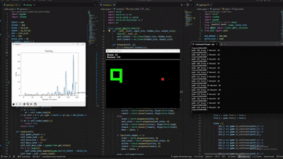

# AI-Powered Snake Game 🐍
This project is a complete implementation of the classic Snake game, built from scratch using Python and Pygame. The primary goal is to train an Artificial Intelligence (AI) agent using **Deep Q-Learning (DQN)** to play the game autonomously and achieve the highest possible score.

[](gameplay.gif)
*(Note: You can click on the image to see the full GIF.)*

---

## ✨ Features
- **Complete Snake Game:** Built from the ground up with Pygame, including all core game mechanics.
- **DQN Agent:** A Reinforcement Learning agent that learns from experience to master the game.
- **Advanced State Representation:** The agent uses a 19-feature state vector for broad spatial awareness, including immediate dangers, a map of its surroundings, and food location.
- **Experience Replay:** Implements a memory buffer to store and sample past experiences, stabilizing the learning process.
- **Live Training Visualization:** The training loop is accompanied by a real-time plot to monitor scores and their moving average.
- **Optimized for Speed:** The training loop is decoupled from human-viewable speed, allowing the agent to learn rapidly.

---

## 🛠️ Tech Stack
- **Python 3**
- **Pygame** for the game engine and graphics.
- **PyTorch** for building and training the neural network model.
- **Matplotlib** & **IPython** for live data visualization.
- **NumPy** for state representation.

---

## 🚀 Setup and Installation
To run this project on your local machine, follow these steps:

1.  **Clone the Repository**
    ```bash
    git clone [https://github.com/username/RL-Snake-Pygame.git](https://github.com/username/RL-Snake-Pygame.git)
    cd RL-Snake-Pygame
    ```
    *(Replace `username` with your GitHub username.)*

2.  **Create and Activate a Virtual Environment**
    ```bash
    # Create the venv
    python -m venv venv

    # Activate on Windows
    .\venv\Scripts\activate

    # Activate on macOS/Linux
    source venv/bin/activate
    ```

3.  **Install Dependencies**
    Use the `requirements.txt` file to install all necessary libraries.
    ```bash
    pip install -r requirements.txt
    ```

---

## 🎮 How to Run
The project has two execution modes:

1.  **Train the AI Agent (Default Mode)**
    Run the `agent.py` file to start the training process.
    ```bash
    python agent.py
    ```
    You will see the game window where the AI plays at high speed, and a plot will appear to track its progress.

2.  **Play as a Human**
    If you want to try the game yourself, run the `game.py` file.
    ```bash
    python game.py
    ```

---

## 📂 Project Structure
```
.
├── agent.py        # Main file for training the AI agent
├── game.py         # Core logic and engine for the Snake game
├── model.py        # Neural Network (Linear_QNet) and Trainer (QTrainer) definitions
├── plot.py         # Script for plotting visualization
├── requirements.txt # List of project dependencies
├── LICENSE         # MIT License
└── README.md       # This documentation
```